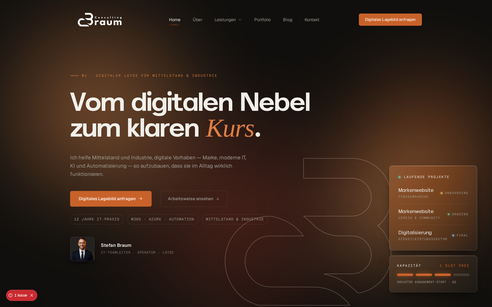

# Braum Consulting

Production-Website fuer Stefan Braum. Digitaler Lotse fuer Mittelstand und
Industrie — Marke, M365, AI und Automatisierung, Transformation.

Live: **[braum.consulting](https://braum.consulting)**

Dieses Repository ist als Showcase oeffentlich. Der Code ist sichtbar fuer
Referenz und Transparenz. Nutzung, Kopie oder Ableitung ist nicht gestattet
(siehe [LICENSE](LICENSE)).

## Stack

- **Next.js 16** (App Router, Turbopack) auf **React 19**
- **TypeScript strict**, **Tailwind CSS 4** (`@theme`-Tokens)
- **Motion**, **Lenis**, **GSAP** fuer Animation und Scroll-Choreografie
- **@react-three/fiber** + **three** (lazy, nur Hero)
- **Resend** fuer das Kontaktformular, **Umami** fuer cookieless Analytics
- **Geist** als UI-Face, **Akmorn Grotesque** als Display, **Instrument Serif**
  als Italic-Akzent

## Architektur-Highlights

- **JSON-natives CMS.** Services, Cases, Blog, Lexikon, FAQs leben in
  typisierten Modulen unter `lib/`. Eine Quelle, eine Stelle zum Aendern.
- **Vollstaendige Static Generation.** Alle Service-, Case- und Lexikon-Seiten
  werden via `generateStaticParams` prerendert.
- **Glass-Card-Aesthetic mit Brand-Token-System.** OKLCH-balancierte Accent-Paare,
  einheitliche Radii (6 / 10 / 14–20 px), klare Hard-Nos im Brand Skill.
- **Reading-Highlight, Scroll-Progress, cinematic Heros.** Hero-Choreografie
  mit Three.js, GSAP-Timeline und Lenis fuer das gleitende Scroll-Gefuehl.
- **80+ 301-Redirects** in `next.config.ts` fuer die WordPress-Migration —
  keine verlorenen Links, keine SEO-Luecken.
- **Rate-limited Contact-Server-Action.** In-Memory Token-Bucket, 5/h/IP,
  Resend-Versand serverseitig, keine API-Keys im Client.

## Lizenz

[LICENSE](LICENSE) — All Rights Reserved. Restriktiv mit Absicht: dieses
Repository ist Marken-IP und Live-Produktion, kein Starter-Template. Wer Code
oder Patterns verwenden moechte, geht ueber das Kontaktformular auf
[braum.consulting/kontakt](https://braum.consulting/kontakt).

## Ueber

[Stefan Braum](https://www.linkedin.com/in/stefanbraum) ist Operator —
nicht Berater. Aus Hessen, fuer Mittelstand und Industrie. Marke, M365, AI
und Automatisierung, digitale Transformation.

Kontakt: [braum.consulting/kontakt](https://braum.consulting/kontakt)
